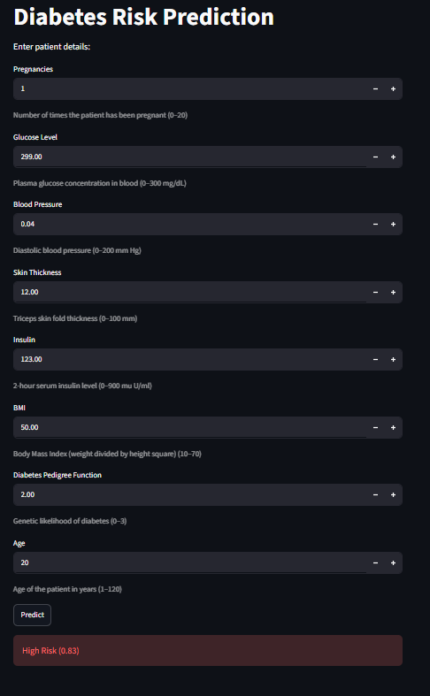

# Diabetes Risk Prediction

This project predicts whether a person is likely to have diabetes using medical information. It uses the PIMA Indian Diabetes Dataset for training, creates additional synthetic samples to increase the dataset size, trains a machine learning model, provides a FastAPI backend for prediction, and includes a Streamlit interface for entering patient details.

## Dataset

The project uses the PIMA Indian Diabetes Dataset.

Original features:

- Pregnancies
- Glucose
- Blood Pressure
- Skin Thickness
- Insulin
- BMI
- Diabetes Pedigree Function
- Age
- Outcome

To increase the amount of training data, additional records are generated from the statistical distribution of each class and merged with the original dataset.

## Data Generation

The `dataGenerator.py` file creates extra samples separately for diabetic and non-diabetic records.

Steps:

- Read the original dataset.
- Calculate the mean and covariance matrix for each class.
- Generate new samples using a multivariate normal distribution.
- Apply basic constraints to avoid negative values for Glucose, Blood Pressure, and BMI.
- Merge generated samples with the original dataset.
- Save the combined dataset as `diabetes_generated.csv`.

## Model Training


We trained three machine learning models and one neural network on the PIMA Indian Diabetes Dataset.

The dataset was first divided into training and testing sets using an 80:20 split. Since the diabetic and non-diabetic classes were not balanced, we applied SMOTE only on the training data to generate additional samples for the minority class. The test data was kept unchanged so that the final evaluation would be done on unseen data. Before training, all input features were standardized using `StandardScaler`.

The first model was Logistic Regression, which gave an accuracy of around 75.97%.

The second model was Random Forest with 300 trees and a maximum depth of 6. This increased the accuracy to around 85.71%.

The third model was XGBoost with 300 estimators, a learning rate of 0.05, maximum depth of 4, subsampling, and column sampling. This model gave the highest accuracy of around 87.01%.

We also trained a feed-forward neural network using TensorFlow and Keras. The network contains three hidden layers with Batch Normalization and Dropout layers to reduce overfitting. The model was trained using the Adam optimizer with binary cross-entropy loss. Early Stopping was used so that the model automatically stopped training when the validation loss stopped improving. The neural network achieved an accuracy of around 81.57%.

After comparing all the models, XGBoost was selected for the prediction API because it produced the highest accuracy. The trained XGBoost model and the fitted scaler were saved together in a `.pkl` file. The neural network model and its scaler were also saved separately for future use.

## API

The backend is written using FastAPI.

### Endpoint

#### GET /

Returns a message indicating that the API is running.

#### POST /predict

Accepts the following values:

- Pregnancies
- Glucose
- Blood Pressure
- Skin Thickness
- Insulin
- BMI
- Diabetes Pedigree Function
- Age

Returns:

- Prediction (0 or 1)
- Probability of diabetes

## Streamlit Interface

The frontend allows users to enter patient information and send it to the FastAPI server.

Input fields:

- Pregnancies
- Glucose
- Blood Pressure
- Skin Thickness
- Insulin
- BMI
- Diabetes Pedigree Function
- Age

The interface also checks a few input values before sending the request.

## Project Structure

```
.
├── app.py
├── main.py
├── dataGenerator.py
├── model.ipynb
├── training.ipynb
├── diabetes.csv
├── diabetes_generated.csv
├── diabetes_model.pkl
├── NeuralNetwork/
│   ├── diabetes_nn_model.h5
│   └── nn_scaler.pkl
├── requirements.txt
└── readme.md
```

## Requirements

- Python 3.10 or later

Install the required packages:

```bash
pip install -r requirements.txt
```

## Run the API

```bash
uvicorn main:app --reload
```

The API will run at:

```
http://127.0.0.1:8000
```

## Run the Streamlit App

```bash
streamlit run app.py
```

## Files

| File | Purpose |
|------|---------|
| `dataGenerator.py` | Generates additional dataset samples |
| `training.ipynb` | Neural network training |
| `model.ipynb` | Machine learning model training |
| `main.py` | FastAPI backend |
| `app.py` | Streamlit frontend |
| `diabetes.csv` | Original PIMA Indian Diabetes Dataset |
| `diabetes_generated.csv` | Expanded dataset |
| `diabetes_model.pkl` | Saved machine learning model and scaler |
| `diabetes_nn_model.h5` | Saved neural network |
| `requirements.txt` | Python dependencies |

## Using the Model to Predict Diabetes 
<p align="center">
  
</p>
